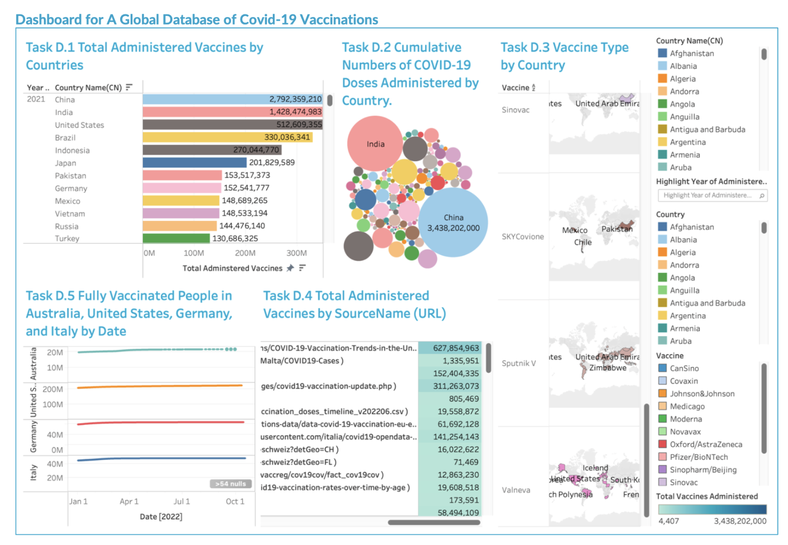

# Dashboard-for-A-Global-Database-of-Covid-19-Vaccinations

  

# Project Title

## Overview

This project provides an in-depth visualization of global COVID-19 vaccination data. It includes detailed dashboards that display key metrics and insights such as total administered vaccines by countries, vaccine types, and cumulative doses administered globally. The data was processed and visualized using SQL queries and data visualization tools to ensure clarity and comprehensiveness.

## Features

- **Visualization of Total Administered Vaccines by Country**: Shows vaccine distribution trends and comparative insights across multiple years.
- **Cumulative Vaccination Data**: Displays the total doses administered per country using a bubble chart for easy interpretation.
- **Vaccine Types Distribution**: Highlights the types of vaccines administered in each country and their coverage globally.
- **Vaccination Trends**: Presents trends in fully vaccinated people across specific countries (Australia, United States, Germany, and Italy).
- **Source Insights**: Provides detailed information about vaccine data sources and their contributions.

## Technologies Used

- SQLite
- Tableau

## Visualizations

### 1. Dashboard Overview

### 2. Fully Vaccinated People in Australia, United States, Germany, and Italy by Date

### 3. Total Administered Vaccines by Source Name (URL)
.png)

### 4. Vaccine Type by Country

### 5. Vaccine Type by Country (Alternate View)

### 6. Cumulative Numbers of COVID-19 Doses Administered by Country

### 7. Total Administered Vaccines by Countries (2022)

### 8. Total Administered Vaccines by Countries (2021)

### 9. Total Administered Vaccines by Countries (Alternate View)

### 10. Total Administered Vaccines by Countries (Overview)

